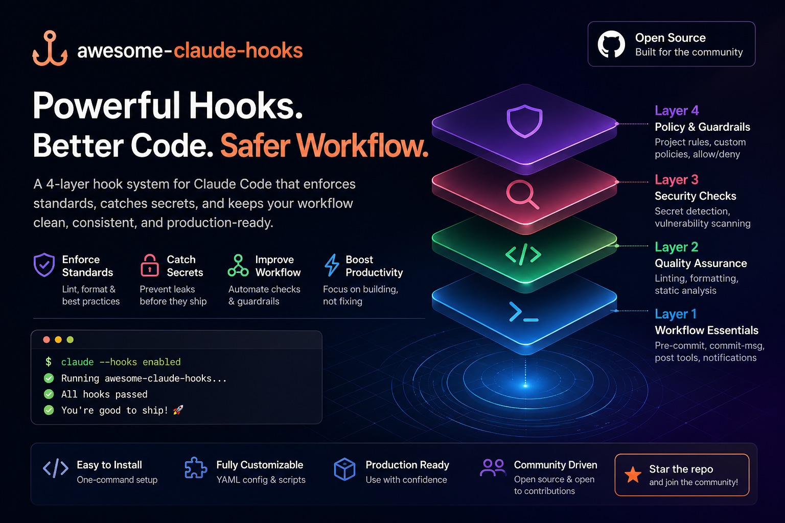

# awesome-claude-hooks

<p align="center">
  
</p>

[](https://awesome.re)
[](LICENSE)
[](CONTRIBUTING.md)
[](#hook-catalog)
[](https://github.com/MohamedAbdallah-14/awesome-claude-hooks/actions/workflows/ci.yml)
[](#testing)

**90 production-ready Claude Code hooks**, spec-aligned and bats-tested. Install a curated profile in one command.

Security guards, quality gates, workflow automation, context injection, and team-safe defaults. shellcheck-clean. Tested on Ubuntu and macOS. Aligned with the official Claude Code [hooks reference](https://code.claude.com/docs/en/hooks).

**Browse hooks:** [mohamedabdallah-14.github.io/awesome-claude-hooks](https://mohamedabdallah-14.github.io/awesome-claude-hooks/) — filter by category, event, risk level, or profile.

---

## Why this exists

Claude Code hooks let you enforce rules deterministically: block dangerous commands, prevent secret writes, run quality gates after edits, inject project context, and notify you when Claude needs attention. This repo gives you:

- working hooks, not just examples
- safe-default profiles you can install in one command
- starter packs for Next.js, Python, Go, Rails, Flutter, Rust, and more
- a hook authoring contract every contribution has to satisfy ([`docs/hook-contract.md`](docs/hook-contract.md))
- shellcheck + bats coverage on every PR
- copy-paste `settings.json` snippets in every hook header
- clear bypass + uninstall instructions

---

## Browse all hooks

Searchable browser: **[mohamedabdallah-14.github.io/awesome-claude-hooks](https://mohamedabdallah-14.github.io/awesome-claude-hooks/)**. Plain markdown index: [`docs/hooks.md`](docs/hooks.md).

---

## Quick start

```bash
git clone https://github.com/MohamedAbdallah-14/awesome-claude-hooks.git ~/.claude/awesome-hooks
cd ~/.claude/awesome-hooks
make install-deps                          # shellcheck, bats-core, jq, pyyaml
bash scripts/install.sh --profile=safe-default --global
```

That installs five low-risk hooks (audit logs, session summary, context warning, desktop notification) into `~/.claude/settings.json`. Claude Code picks them up on the next session.

Other common invocations:

```bash
bash scripts/install.sh --list-profiles            # show available profiles
bash scripts/install.sh --profile=security --global
bash scripts/install.sh --profile=team --project   # writes .claude/settings.json
bash scripts/install.sh --profile=devops --dry-run # preview without writing
```

---

## Start here by intent

If you don't know what to install, pick the goal that sounds like you.

### I want safer Claude Code sessions

Block secrets, protect `.env`, stop dangerous bash, prevent system-path writes.

```bash
bash scripts/install.sh --profile=security --global
```

### I want better code quality

ESLint, Prettier, Ruff, TSC, dart analyze, go vet, JSON/YAML validation, test-coverage check.

```bash
bash scripts/install.sh --profile=quality --project
```

### I want team-ready defaults

Protect `main`, validate commit messages, audit every write, conflict detector, stash guard, daily session log.

```bash
bash scripts/install.sh --profile=team --project
```

### I want to be notified when Claude finishes

Cross-platform desktop banner, plus Slack / Telegram / Discord / Pushover / sound bridges.

```bash
bash scripts/install.sh --profile=notifications --global
```

### I deploy infrastructure

Block `terraform destroy`, `kubectl` against prod, destructive AWS calls, irreversible DB migrations, and unsafe Docker volume removal.

```bash
bash scripts/install.sh --profile=devops --global
```

### I want Haiku-powered review at edit time

Code review, OWASP scan, migration-safety check, commit-message + PR-description drafts.

```bash
export ANTHROPIC_API_KEY=sk-...
bash scripts/install.sh --profile=ai-assisted --global
```

### I'm flying solo

Auto-format, AI commit messages, session-name-from-branch, desktop notifications, project context at session start.

```bash
bash scripts/install.sh --profile=solo-dev --global
```

---

## Profiles

| Profile | Hooks | What you get |
|---------|-------|--------------|
| `safe-default` | 5 | Audit + summary + context guard + desktop notify. Reasonable starting point with zero blocking. |
| `security` | 8 | Block secrets, dangerous bash, system paths, dotenv writes. SQL injection + npm-audit scanners. |
| `quality` | 8 | Linters and gates for JS/TS/Python/Go/Dart, plus JSON/YAML validation and coverage check. |
| `team` | 6 | `main`-branch protection, commit-message validation, write audit, daily summary, conflict + stash guards. |
| `devops` | 7 | Guards for terraform / kubernetes / aws / docker / db migrations / GitHub Actions, plus an infra audit log. |
| `solo-dev` | 5 | Auto-format-on-save, AI commit messages, branch-named sessions, desktop notify, project context at start. |
| `notifications` | 10 | Desktop + macOS + Linux + Slack + Telegram + Discord + Pushover + sounds + terminal title. |
| `ai-assisted` | 5 | Haiku-powered review, OWASP scan, migration safety, commit + PR drafts. Needs `ANTHROPIC_API_KEY`. |

Profile definitions live in [`hooks.registry.yaml`](hooks.registry.yaml). Run `bash scripts/install.sh --list-profiles` to see the resolved hook list for each.

---

## What this modifies

Hooks run with your full user permissions. The installer is conservative and touches only Claude Code's settings file.

- **May edit** `~/.claude/settings.json` (with `--global`) or `.claude/settings.json` in the cwd (with `--project`).
- **Always backs up** the existing settings file before writing (e.g. `settings.json.backup`).
- **Does not install binaries**. Every hook is a shell script that lives in this repo.
- **Does not modify** your shell profile, PATH, git config, npm config, or anything outside Claude Code's settings.
- **Each hook discloses** its dependencies, network access, and bypass env var in its header. See [`docs/compatibility.md`](docs/compatibility.md) for the full operational matrix.

For threat coverage, hook risk levels, and review guidance see [`SECURITY_MODEL.md`](SECURITY_MODEL.md).

---

## Hook catalog

| Category | Hooks | Examples |
|----------|------:|----------|
| [quality/](hooks/quality/) | 15 | eslint-gate, tsc-check, cargo-clippy-gate, ktlint-gate, rubocop-gate |
| [notifications/](hooks/notifications/) | 10 | desktop-notify, slack-notify, telegram-notify |
| [security/](hooks/security/) | 9 | block-secrets, protect-dotenv, block-dangerous-bash, permission-denied-logger |
| [context/](hooks/context/) | 8 | inject-git-context, inject-typescript-errors |
| [session/](hooks/session/) | 8 | session-start-context, precompact-backup, log-tool-failures, session-end-summary |
| [automation/](hooks/automation/) | 7 | auto-format-on-save, auto-run-tests, auto-changelog |
| [git/](hooks/git/) | 7 | protect-main-branch, validate-commit-message, auto-resume-from-stash |
| [devops/](hooks/devops/) | 7 | terraform-destroy-guard, kubernetes-prod-guard |
| [ai/](hooks/ai/) | 5 | ai-code-review, ai-security-scan, ai-migration-safety |
| [cost/](hooks/cost/) | 5 | budget-alert, daily-usage-report, session-timer |
| [prompt/](hooks/prompt/) | 5 | auto-approve-readonly, rate-limiter, banned-words-enforcer |
| [fun/](hooks/fun/) | 4 | motivational-quote, break-reminder, ascii-confetti |

Pre-wired stack bundles (Next.js, Flutter, Python, NestJS, Go, Rails, Rust, Laravel, Android, iOS, data-science) live under [`starter-packs/`](starter-packs/).

---

## Hero docs

Worked walkthroughs (problem, before/after, install, test, bypass, safety) for the highest-stakes hooks:

- [block-secrets](docs/hooks/block-secrets.md)
- [block-dangerous-bash](docs/hooks/block-dangerous-bash.md)
- [protect-dotenv](docs/hooks/protect-dotenv.md)
- [validate-json-yaml](docs/hooks/validate-json-yaml.md)
- [terraform-destroy-guard](docs/hooks/terraform-destroy-guard.md)

---

## Docs

- [`docs/hook-contract.md`](docs/hook-contract.md) — what every hook must include, and how to write a new one
- [`docs/events.md`](docs/events.md) — hooks grouped by Claude Code event (generated)
- [`docs/compatibility.md`](docs/compatibility.md) — operational matrix (generated)
- [`docs/claude-code-versions.md`](docs/claude-code-versions.md) — minimum Claude Code version per event
- [`docs/benchmarks.md`](docs/benchmarks.md) — per-hook latency (p50, p99) by event, regenerated by `make bench`
- [`SECURITY_MODEL.md`](SECURITY_MODEL.md) — threats covered + not covered, hook risk levels
- [`CONTRIBUTING.md`](CONTRIBUTING.md) — how to propose a new hook
- [Claude Code hooks reference](https://code.claude.com/docs/en/hooks) — the official spec

---

## Testing

Every hook is shellcheck-clean. Hooks that can block (security, quality, git) have bats tests under `tests/<category>/`.

```bash
brew install shellcheck bats-core jq        # macOS
sudo apt-get install shellcheck bats jq     # Debian/Ubuntu

shellcheck -S warning hooks/**/*.sh scripts/*.sh
bash scripts/lint-hooks.sh                  # enforces docs/hook-contract.md
bats -r tests
```

CI runs all three on every push and on PRs against `main`, on Ubuntu and macOS.

---

## Contributing

Bug fixes, new hooks, and new starter packs are welcome. See [CONTRIBUTING.md](CONTRIBUTING.md) for the submission checklist. Primarily: the script must be self-contained, work without external services by default, and include a header comment block describing the event, required env vars, and any optional configuration.

---

## License

CC0. Public domain. Use freely, no attribution required.
